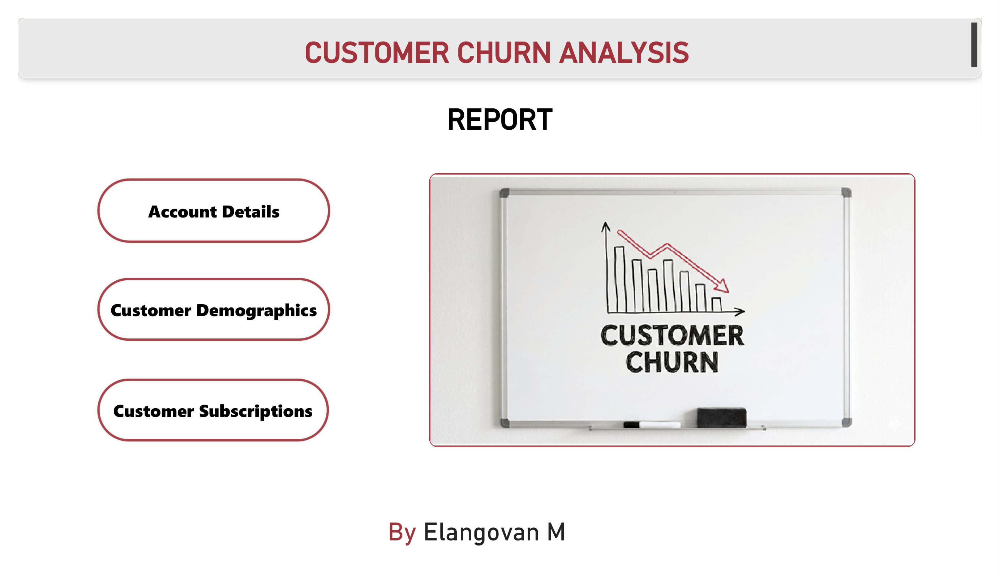
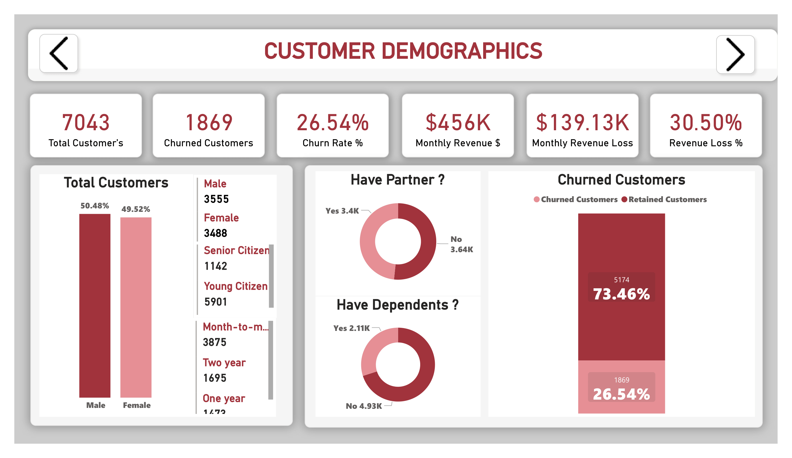
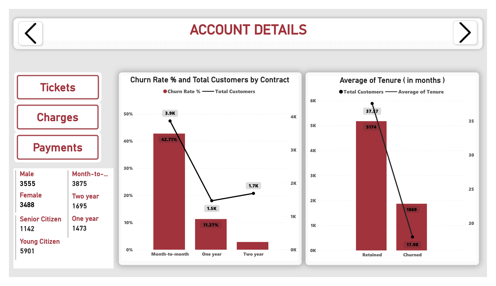
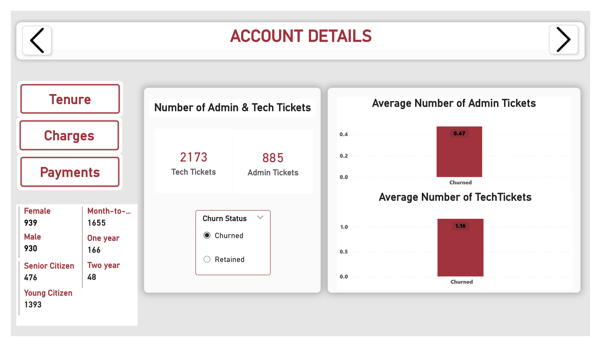
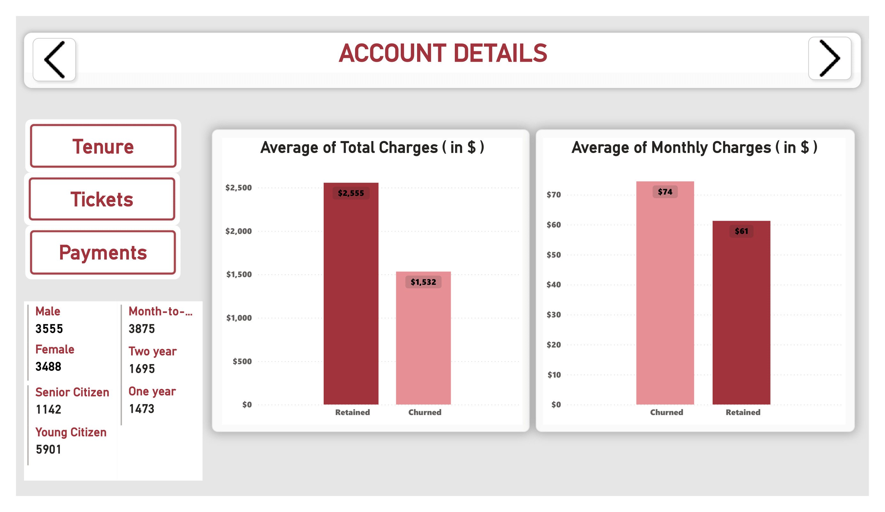
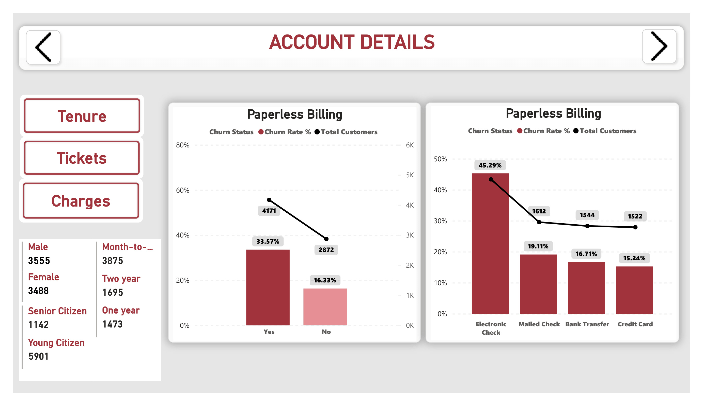
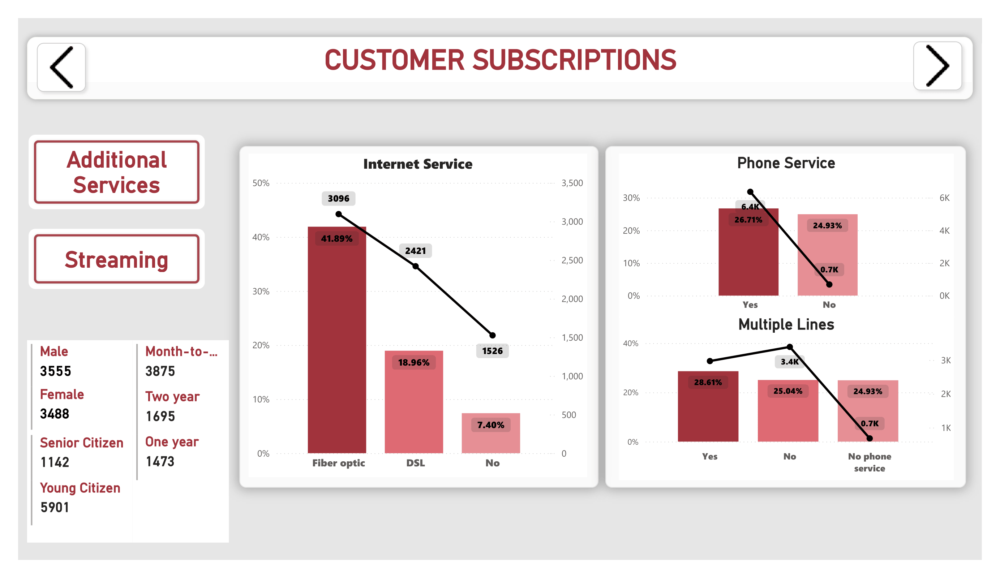
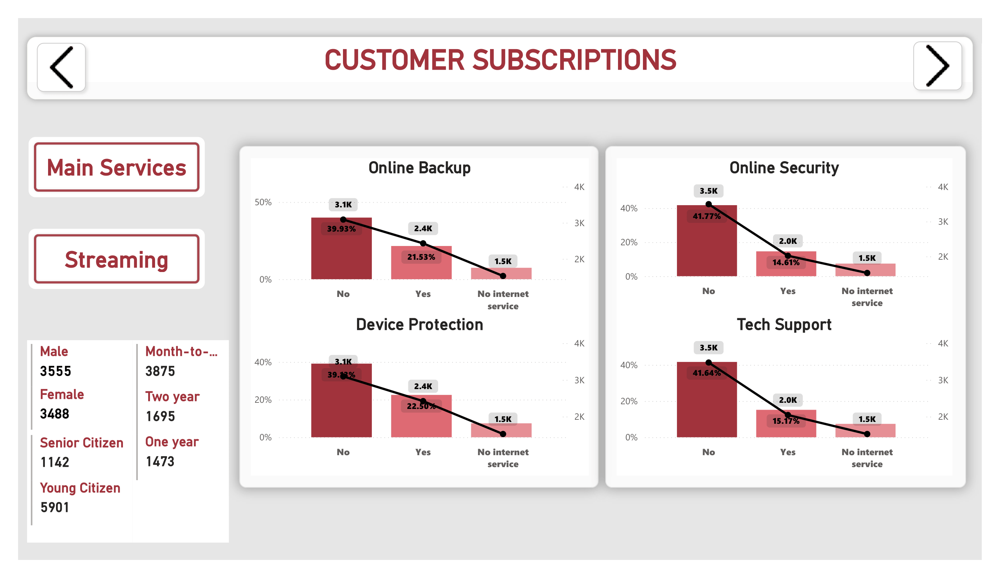
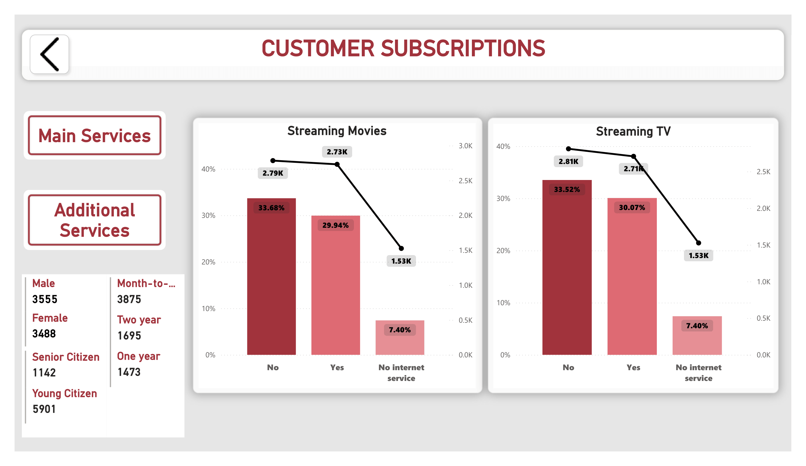

# 📊 Customer Churn Analysis - Power BI

## 📝 Project Overview
This project analyzes customer churn data to identify why customers leave and how to retain them. The dashboard visualizes key metrics like churn rate, revenue loss, and service-specific trends.

**Dataset Used:** IBM Sample Data (Telco Customer Churn)

## 📷 Dashboard Screenshots

### 1. Account Details & Overview

*Provides a high-level view of churn rate (26.54%), total customers (7,043), and revenue impact.*

### 2. Demographics & Subscriptions

*Analyzes churn by gender, seniority, and contract type.*

### 3. Service & Support Analysis

*Breakdown of internet services, tech support tickets, and payment methods.*

*(Note: Images above are placeholders. See "How to Add Screenshots" below to make them visible.)*

## 🔑 Key Insights
* **Overall Churn Rate:** 26.54% (1,869 customers lost).
* **Contract Type:** Customers on **Month-to-Month** contracts have the highest churn rate at **42.71%**, while Two-Year contract holders churn least.
* **Internet Service:** **Fiber Optic** users have a significantly higher churn rate (**41.89%**) compared to DSL users.
* **Payment Method:** **Electronic Check** payers have the highest churn (**45.29%**).
* **Support Issues:** Churned customers raise significantly more **Tech Support Tickets** (avg 1.16) than retained customers.

## 🛠️ Tools Used
* **Power BI Desktop** (Data Cleaning, DAX, Visualization)
* **Power Query** (ETL Process)

## 🚀 How to View
1.  Download the `.pbix` file from this repository.
2.  Open in **Microsoft Power BI Desktop**.
